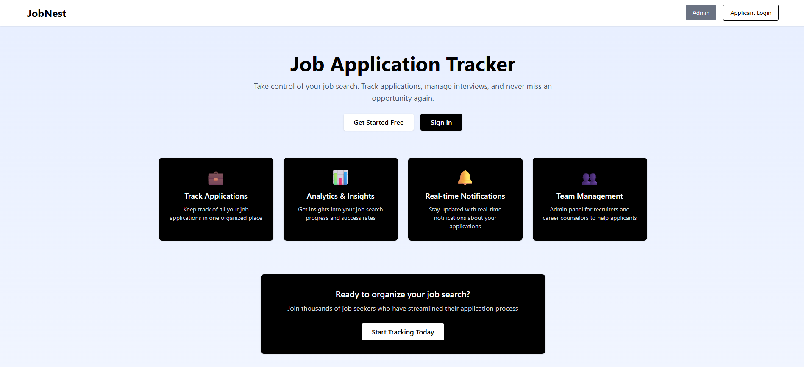
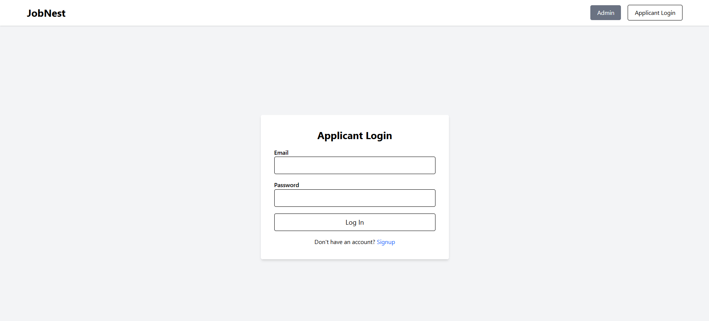
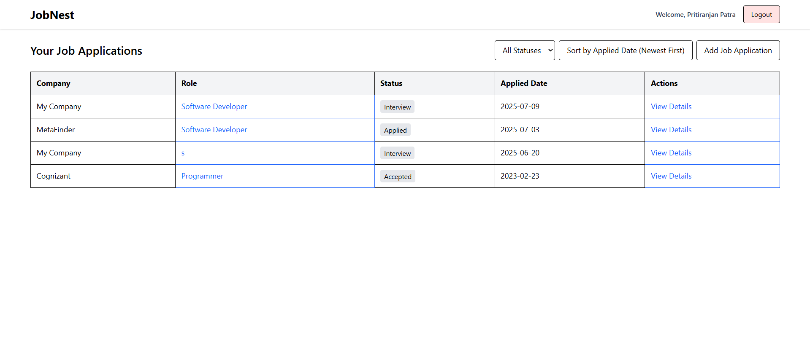
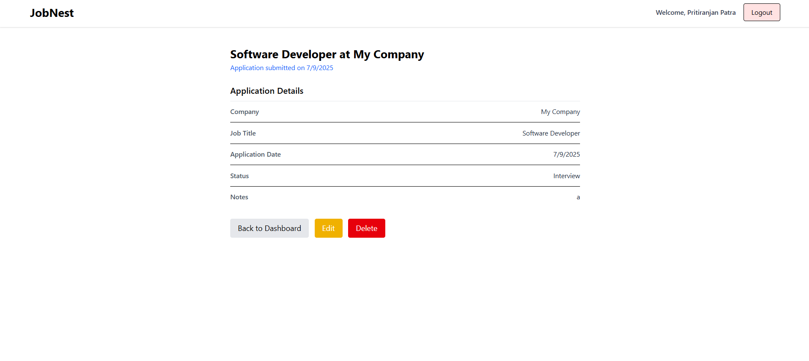
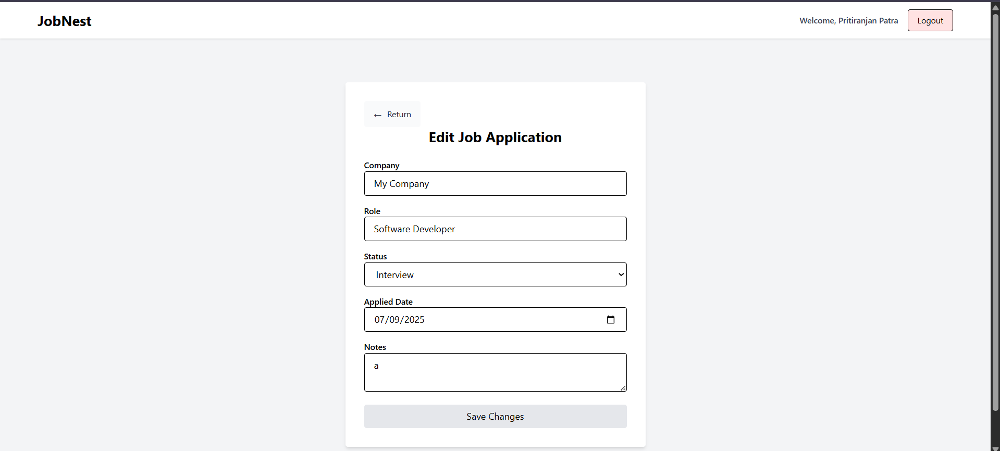
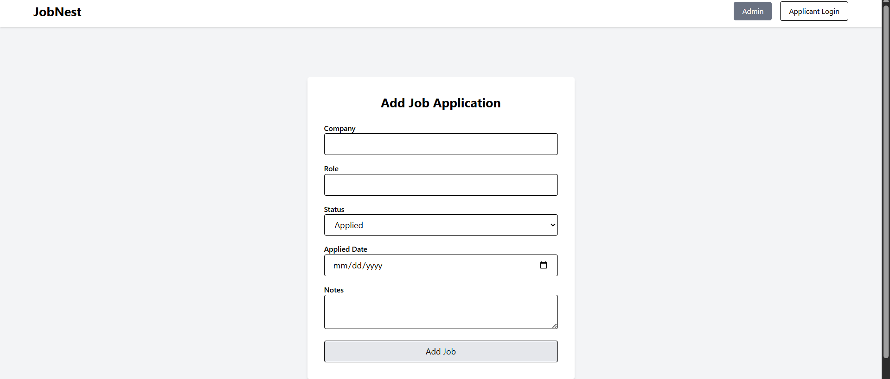
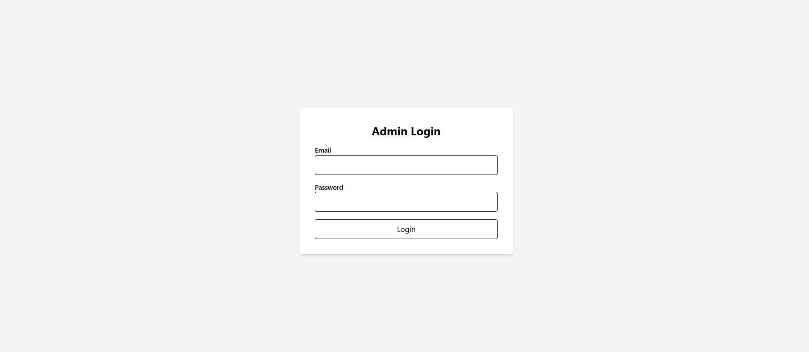
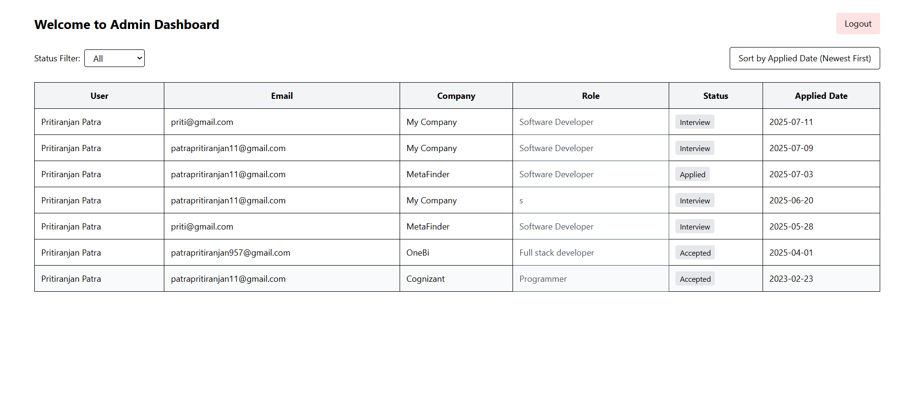

# 🚀 JobNest – Job Application Tracker (Mini CRM)

**JobNest** is a simple and powerful job application tracking system (Mini CRM) that allows applicants to manage their job hunt and enables admins to monitor applications. Built using the **MERN stack**, the project includes authentication, CRUD features, filtering, sorting, and a responsive dashboard.

## 🌐 Live Links

- **Backend:** [https://jobnest-b.vercel.app](https://jobnest-b.vercel.app)
- **Frontend:**  [https://job-nest-pp.vercel.app/](https://job-nest-pp.vercel.app/)
## 🌐 Admin Details

#### AdminEmail-:admin@gmail.com
#### AdminPassword-:admin123 

## 🌐 .env For Backend 

#### MONGODB_URI=#
#### JWT_SECRET=#
#### PORT=#
#### NODE_ENV=#
#### ADMIN_EMAIL=admin@gmail.com
#### ADMIN_PASSWORD=admin123
#### AdminEmail-:admin@gmail.com
#### AdminPassword-:admin123 

## 🌐 📚 API Endpoints
## User Routes
 #### POST /api/user/register: Register a new user (sets token cookie).
 #### POST /api/user/login: Login user (sets token cookie).
 #### GET /api/user/is-auth: Check user authentication (requires token cookie).
 #### GET /api/user/logout: Logout user (clears token cookie).
## Admin Routes
 #### POST /api/admin/login: Login admin (sets adminToken cookie).
#### GET /api/admin/is-auth: Check admin authentication (requires adminToken cookie).
#### GET /api/admin/logout: Logout admin (clears adminToken cookie).
#### GET /api/admin/getAll: Retrieve all job applications (requires adminToken cookie).
## Job Routes
#### GET /api/jobs/: List user’s jobs (requires token cookie).
#### POST /api/jobs/: Create a job application (requires token cookie).
#### GET /api/jobs/:id: Get job details (requires token cookie).
#### PUT /api/jobs/:id: Update a job (requires token cookie).
#### DELETE /api/jobs/:id: Delete a job (requires token cookie)

## 📸 Screenshots
### 🧑‍💼 Applicant Dashboard

### 🧑‍💼 Applicant login

### 🧑‍💼 Applicant Dashboard with filter seciton (applied by date and status)

### 🧑‍💼 View Details with Edit Delete functionality

### 🧑‍💼 Edit Details page

### 📝 Job Application Form

### 📊 Admin login

### 📊 Admin dashbord

---

## 📚 Features

### ✅ User Authentication
- Register / Login using JWT
- Protected routes for users and admin
- Auth persistence via cookies

### 👨‍💼 Applicant Panel
- Add, edit, delete, view job applications
- Fields: `company`, `role`, `status`, `appliedDate`, `notes`
- Status options: `"Applied"`, `"Interview"`, `"Offer"`, `"Rejected"`, `"Accepted"`

### 🧑‍💻 Admin Panel
- View all user applications
- Filter by `status`
- Sort by `applied date`

---

## 🧱 Tech Stack

- **Frontend:** React, Tailwind CSS, Axios, Vite
- **Backend:** Node.js, Express.js, JWT, MongoDB, Mongoose
- **Database:** MongoDB Atlas
- **Deployment:** Vercel (Frontend), Render or Railway (Backend)

 